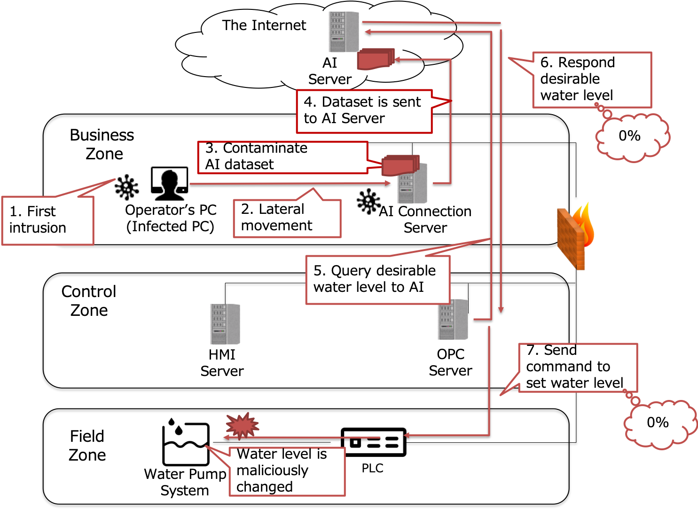

# Attack demonstration took kits for Industry 4.0 using AI and cloud

We introduce attack demonstration took kits for Industry 4.0 using actual machines (water supply pump system).

This tool kit is portable, and easy to prepare, so is useful for instructing the cyber-risks of ICS whenever and whenever we want.
In aspects of Industry 4.0, we especially focus on the security risks of ICS in the following aspects:
* When computers and devices are connected interactively
* When AI on the cloud is used for controlling the ICS

<a href="https://github.com/sisoc-tokyo/AttackDemoTookkit_Industry4/blob/master/AttackDemoTookkitsforIndustry4usingAIandCloud.pdf.pdf" download>Documentation of the tool is here</a>

## Demo Tool detail
Our demonstration tool consists of the following.
* the water supply pump system
* Attack tools

Structure of the water supply pump system is as follows.
* Water pump: Provides water for consumers.
* Controller: Controls the water level of the cylinder.
* OPC / HMI Server (Windows Server 2008 R2): Relays communications among Controller using Modbus/TCP.
* AI Connection server (Windows 7): Stores the dataset of the past water level per time.
* AI server on the cloud (Cent OS 7): Instruct the desirable water level per time using AI.

## Attack scenario
1. Infects a PC in the Business zone
2. A lateral movement to AI Connection Server
3. Contaminate the AI dataset
4. The contaminated dataset is sent to AI Server
5. OPC Server queries the desirable water level to the AI Server
6. AI Server returns incorrect value judged from the contaminated dataset
7. OPC Server sends incorrect SetPoint to PLC
8. The water rate is maliciously changed
  
